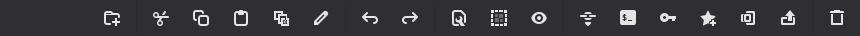
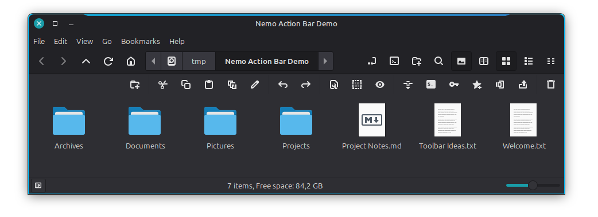

# Nemo Action Bar

A configurable power bar above Nemo's file view. The default layout provides
18 direct buttons for creating folders, clipboard operations, undo/redo,
selection and view controls, paths, terminal/admin access, favorites, archives
and the trash.



The same default layout in a real Nemo window, together with Nemo's original
toolbar and the [active-window highlight](https://github.com/ClaudiuSchuster/cinnamon-active-window-highlight):



Nemo does not expose a public hook for third-party buttons in its built-in
toolbar. This extension therefore uses Nemo's supported Python
`LocationWidgetProvider` interface and places a native GTK bar immediately
above the directory view. Each button activates an allowlisted Nemo `GtkAction`
or a known keyboard accelerator. File selection, capability checks,
confirmation dialogs and file operations therefore remain under Nemo's
control. No configurable shell commands are executed.

## Requirements and installation

- Nemo 5 or newer
- `nemo-python`
- GTK 3 Python introspection bindings
- Optional: `nemo-fileroller` for **Create archive** and **Extract here**

```bash
git clone https://github.com/ClaudiuSchuster/nemo-action-bar.git
cd nemo-action-bar
./install.sh
```

Then close every Nemo window and start Nemo again. Existing user configuration
is preserved during updates. To install a later version, run `git pull` in the
checkout followed by `./install.sh` again.

## Configuration

The default configuration is installed only when
`~/.config/nemo-action-bar/buttons.json` does not yet exist. Valid changes are
picked up live by open Nemo windows. A button consists of an ID, a label, an
installed GTK icon name and one of the supported action IDs:

```json
{
  "id": "duplicate",
  "label": "Duplicate",
  "icon": "nemo-action-bar-duplicate-symbolic",
  "action": "duplicate"
}
```

Use `{ "type": "separator" }` for a separator or `"enabled": false` to hide
an entry temporarily. Shortcut-only entries from earlier releases remain
supported; their `shortcut` must be a valid GTK accelerator. Arbitrary command
lines are intentionally not supported.

### Supported actions

| Action ID | Behavior |
| --- | --- |
| `new-folder` | Create and immediately name a folder |
| `cut`, `copy`, `paste` | Nemo's native clipboard operations |
| `duplicate`, `rename`, `trash` | Operate on the current selection |
| `undo`, `redo` | Nemo's file-operation history |
| `properties`, `select-all` | Properties or full selection |
| `show-hidden` | Toggle hidden files for the current window |
| `copy-path` | Put selected local paths/URIs on the clipboard as plain text |
| `open-terminal` | Open Nemo's configured terminal at the selected/current folder |
| `open-admin` | Use Nemo's built-in “Open as Root” action and authentication dialog |
| `favorite-toggle` | Add or remove the selection according to its current state |
| `archive-create` | Open File Roller's archive-creation dialog (`nemo-fileroller`) |
| `archive-extract` | Extract the selected supported archive here (`nemo-fileroller`) |

The shipped configuration deliberately shows every action as a direct button.
Copy `buttons.json` from the repository over your personal configuration if you
want to adopt the current default layout after an update.

## Uninstall

Run `./uninstall.sh`. The user configuration is deliberately retained and can
be removed separately if it is no longer needed. Restart Nemo afterwards.

## Cinnamon Spices status

This project is a Nemo Python UI extension, not a Cinnamon desktop extension
and not a declarative Nemo context-menu Action. It therefore does not fit the
Cinnamon Extensions or Cinnamon Actions download categories in their current
form. Community distribution can use this repository, a distro package, or an
upstream proposal to Nemo/nemo-extensions.

Licensed under GPL-2.0-or-later. See `LICENSE`.
